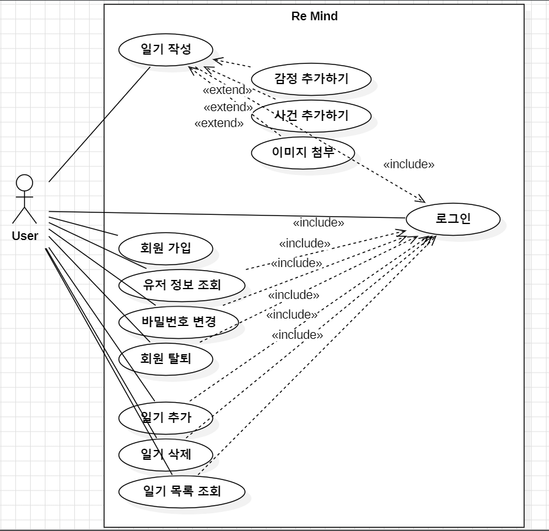

**1. Introduction**

**1.1. Summary**

**1.2 Business Goals**
  - User가 일기의 내용을 작성하는데 있어서 감정 및 심리적인 요소를 위주로 작성하고 다루는데 도움이 되어야 한다.
  - User가 

**1.3 Technical Goals**
  - User가 일기를 작성하는 창에서 사용할수 있는 다양한 기능에 대해서 UI/UX가 사용하기 쉬운 형태로 되어있어야 한다.
  - User가 작성한 일기는 보기 쉽게 목록으로 풀어서 보여줄 수 있어야 한다.
  - User가 일기를 작성하는 창에서 감정에 대한 정보를 세부적으로 적기위한 별도의 창들을 자유롭게 생성하고 삭제할 수 있어야 한다.

**2. Use case analysis**

**2.1 Use Case Diagram**

**2.2 Use Case Description**

|Use case #1: 회원 가입||
|:------:|:------|
|GENERAL CHARACTERISTICS||
|Summary|시스템은 User가 입력한 정보로 회원을 등록시킨다.|
|Scope|Re: Mind|
|Level|User level|
|Author|이준영|
|Last Update||
|Status|Analysis|
|Primary Actor|User|
|Preconditions|시스템이 로그인 창을 로딩 완료한 상태어야 한다.|
|Trigger|User가 "회원가입하기"라고 적힌 버튼을 클릭했을 때|
|Success Post Condition|시스템은 User가 입력한 정보를 기반으로 회원으로 등록한다.|
|Failed Post Condition|시스템은 User가 입력한 정보로 회원이 등록되지 않는다.|
|MAIN SUCCESS SCENARIO||
|Step|Action|
|1|User가 회원가입하기 버튼을 클릭한다.|
|2|시스템은 User가 사용할 id와 password를 입력하는 박스와 회원가입 버튼으로 구성된 창을 보여준다.|
|3|User는 자신이 사용할 id와 password를 박스에 입력한다.|
|4|User는 회원가입 버튼을 클릭한다.|
|5|시스템은 User가 입력한 id와 password로 회원을 등록한다.|
|EXTENSION SCENARIO||
|Step|Action|
|4|4a. User가 입력한 id가 이미 사용되고 있는 경우   4a.1 시스템은 id를 입력하는 박스 아래에 "이미 사용되고있는 id입니다. 다른 id를 작성해주세요."라는 글자를 표시한다.   4a.2 User가 id와 password를 입력하는 단계로 돌아간다. (Use case #1-3)   4b. User가 입력한 id가 허용된 문자(숫자, 알파벳, _)가 아닌 문자가 포함되어 있는 경우   4b.1 시스템은 id를 입력하는 박스 아래에 "숫자, 알파벳, _문자의 조합으로만 구성된 id로 작성해 주세요."라는 글자를 표시한다.   4b.2 User가 id와 password를 입력하는 단계로 돌아간다. (Use case #1-3)   4c. User가 입력한 password가 8\~20 문자를 벗어났거나 아스키 문자이외의 문자가 포함되어있는 경우   4c.1 시스템은 password를 입력하는 박스 아래에 "8\~20문자의 아스키 문자로만 구성된 비밀번호로 입력해주세요"라는 글자를 표시한다.   4c.2 User가 id와 password를 입력하는 단계로 돌아간다. (Use case #1-3)|
|RELATED INFORMATION||
|Performance|≦ 2 Seconds|
|Frequency|User당 하루에 평균 2번|
|Concurrency|제한 없음|
|Due Date||

|Use case #2: 로그인||
|:------:|:------|
|GENERAL CHARACTERISTICS||
|Summary|User는 id와 password를 입력하고 자신의 계정으로 접속한다.|
|Scope|Re: Mind|
|Level|User level|
|Author|이준영|
|Last Update||
|Status|Analysis|
|Primary Actor|User|
|Preconditions|회원가입이 완료 되어있어야 한다.|
|Trigger|User가 Re: Mind를 실행 하였을때|
|Success Post Condition|User는 자신이 회원가입한 계정으로 접속한다.|
|Failed Post Condition|User는 계정으로 접속하지 못한다.|
|MAIN SUCCESS SCENARIO||
|Step|Action|
|1|시스템은 id와 password를 입력하는 박스와 로그인 버튼, 회원가입하기 버튼으로 구성된 창을 보여준다.|
|2|User가 박스에 id와 password를 입력한다.|
|3|User가 로그인 버튼을 누른다.|
|4|시스템은 회원가입된 계정 중에서 User과 입력한 id와 password가 일치한 계정이 있는지 확인후, 일치한 계정으로 접속을 시킨다.|
|EXTENSION SCENARIO||
|Step|Action|
|3|3a. User가 입력한 id와 password와 일치한 회원가입된 계정이 없는 경우   3a.1 시스템은 id를 입력하는 박스 아래에 "id또는 비밀번호가 일치하지 않습니다."라는 글자를 표시한다.   3a.2 User가 id와 password를 입력하는 단계로 돌아간다. (Use case #2-2)|
|RELATED INFORMATION||
|Performance|≦ 2 Seconds|
|Frequency|User당 하루에 평균 10번|
|Concurrency|제한 없음|
|Due Date||

|Use case #3: 비밀번호 변경||
|:------:|:------|
|GENERAL CHARACTERISTICS||
|Summary|시스템은 User의 비밀번호를 기존 비밀번호에서 User가 입력한 새로운 비밀번호로 변경시켜준다.|
|Scope|Re: Mind|
|Level|User level|
|Author|이준영|
|Last Update||
|Status|Analysis|
|Primary Actor|User|
|Preconditions|로그인 되어있는 상태어야 한다.|
|Trigger|User가 "비밀번호 변경" 이라고 적힌 버튼을 클릭했을 때|
|Success Post Condition|User의 비밀번호가 새로 입력한 비밀번호로 변경 된디.|
|Failed Post Condition|User의 비밀변호가 변경되지 않는다.|
|MAIN SUCCESS SCENARIO||
|Step|Action|
|1|User가 비밀번호를 변경하는 옵션을 실행한다.|
|2|시스템이 비밀번호 변경 버튼과 기존 비밀번호, 변경할 비밀번호, 변경할 비밀번호를 확인차 입력할 박스를 보여준다.|
|3|User는 기존 비밀번호와 변경할 비밀번호, 변경할 비밀번호를 확인차 입력할 박스에 정보를 입력한다.|
|4|비밀번호 변경 버튼을 클릭한다.|
|5|시스템은 User의 비밀번호를 변경할 비밀번호 박스에 입력한걸로 변경한다.|
|6|시스템은 박스를 닫는다.|
|EXTENSION SCENARIO||
|Step|Action|
|4|4a. User가 입력한 기존 password가 일치하지 않는 경우   4a.1 시스템은 기존비밀번호를 입력하는 박스 아래에 "기존 비밀번호가 일치하지 않습니다." 라는 글자를 출력한다.   4a.2 User가 기존 비밀번호와 변경할 비밀번호, 변경할 비밀번호를 확인 입력을 하는 단계로 돌아간다. (Use case #3-3)   4b. User가 입력한 password가 8\~20 문자를 벗어났거나 아스키 문자이외의 문자가 포함되어있는 경우   4b.1 시스템은 password를 입력하는 박스 아래에 "8\~20문자의 아스키 문자로만 구성된 비밀번호로 입력해주세요"라는 글자를 표시한다.   4b.2 User가 기존 비밀번호와 변경할 비밀번호, 변경할 비밀번호를 확인 입력을 하는 단계로 돌아간다. (Use case #3-3)|   4c. 비밀번호 확인 박스에 입력한 것이 새로운 비밀번호를 입력하는 박스에 입력한 것과 일치하지 않을 경우   4c.1 시스템은 비밀번호 확인 박스 아래에 "새로운 비밀번호와 일치하지 않습니다."라는 글자를 출력한다.   4c.2 User가 기존 비밀번호와 변경할 비밀번호, 변경할 비밀번호를 확인 입력을 하는 단계로 돌아간다. (Use case #3-3)|
|RELATED INFORMATION||
|Performance|≦ 1.5 Seconds|
|Frequency|User당 하루 평균 1번|
|Concurrency|제한 없음|
|Due Date||

|Use case #4: 유저 정보 조회||
|:------:|:------|
|GENERAL CHARACTERISTICS||
|Summary|User에 대한 정보를 조회 및 수정할 수 있는 기능이다.|
|Scope|Re: Mind|
|Level|User level|
|Author|이준영|
|Last Update||
|Status|Analysis|
|Primary Actor|User|
|Preconditions|로그인이 되어있는 상태어야 한다.|
|Trigger|유저 정보 조회 버튼을 클릭했을 때|
|Success Post Condition|시스템은 유저에 대한 정보와 일부 정보를 수정할 수 있는 창을 보여준다.|
|Failed Post Condition|시스템은 유저에 대한 정보와 일부 정보를 수정할 수 있는 창을 보여주지 못한다.|
|MAIN SUCCESS SCENARIO||
|Step|Action|
|1|User가 유저 조회 버튼을 클릭한다.|
|2|시스템은 User의 id가 적힌 칸과 비밀번호 변경 버튼, 회원 탈퇴 버튼 으로 구성된 창을 보여준다.|
|EXTENSION SCENARIO||
|Step|Action|
|2|2a. User에 대한 정보를 불러오는데 실패해서 창을 재대로 못 불러올 경우   2a.1 시스템은 "유저 정보를 불러오는데 실패하였습니다. 나중에 다시 시도하여주세요."라는 글자가 적힌 적힌 창을 보여준다.|
RELATED INFORMATION
|Performance|≦ 1.5 Seconds|
|Frequency|User당 하루에 평균 3번|
|Concurrency|제한 없음|
|Due Date||

|Use case #5: 일기 목록 조회||
|:------:|:------|
|GENERAL CHARACTERISTICS||
|Summary|User가 작성한 일기들을 목록 형태로 보여준다.|
|Scope|Re: Mind|
|Level|User level|
|Author|이준영|
|Last Update||
|Status|Analysis|
|Primary Actor|User|
|Preconditions|로그인이 되어있어야 한다.|
|Trigger|로그인이 이루어졌을 때|
|Success Post Condition|User가 작성한 일기들에 대한 목록을 날짜에 맞춰 정렬해서 창의 형태로 보여준다.|
|Failed Post Condition|User가 작성한 일기들에 대한 목록을 보여주지 못한다.|
|MAIN SUCCESS SCENARIO||
|Step|Action|
|1|User가 로그인을 한다.|
|2|시스템은 로그인한 해당 유저의 정보를 불러온다.|
|3|시스템을 불러온 정보로 User가 작성한 일기를 날짜별로 정렬하여 목록과 "일기 추가하기"버튼이 있는 창을 보여준다.|
|EXTENSION SCENARIO||
|Step|Action|
|2|2a. 시스템이 User의 정보를 불러오는데 실패한 경우   2a.1 시스템은 "죄송합니다. {{User}}님의 정보를 불러오는데 실패했습니다."라는 글자가 적힌 창을 보여준다.|
|RELATED INFORMATION||
|Performance|≦ 5 Seconds|
|Frequency|User당 하루에 평균 5번|
|Concurrency|제한 없음|
|Due Date||

|Use case #6: 일기 삭제||
|:------:|:------|
|GENERAL CHARACTERISTICS||
|Summary|User가 작성한 일기중 선택한 날짜의 일기를 삭제한다.|
|Scope|Re: Mind|
|Level|User level|
|Author|이준영|
|Last Update||
|Status|Analysis|
|Primary Actor|User|
|Preconditions|로그인이 되어있는 상태어야 한다.|
|Trigger|User가 일기삭제 버튼을 클릭했을 때|
|Success Post Condition|User가 선택한 날짜의 일기 내용이 삭제된다.|
|Failed Post Condition|User가 선택한 날짜의 일기 내용이 삭제되지 않는다.|
|MAIN SUCCESS SCENARIO||
|Step|Action|
|1|User가 삭제 버튼을 누른다.|
|2|시스템이 "정말로 삭제하시겠습니까? 한번 삭제후 되돌릴 수 없습니다."라고 적힌 글자와 예, 아니오 버튼으로 구성된 팝업을 보여준다.|
|3|User가 예 라는 버튼을 클릭한다.|
|4|시스템이 팝업을 닫는다.|
|5|시스템이 해당 날짜의 일기를 삭제한다.|
|EXTENSION SCENARIO||
|Step|Action|
|3|3a. User가 아니오 라는 버튼을 누를 경우   3a.1 시스템이 팝업을 닫는다.   3a.2 달력형태의 칸으로 돌아간다.|
RELATED INFORMATION
|Performance|≦ 1.5 Seconds|
|Frequency|User당 하루 평균 1번|
|Concurrency|제한 없음|
|Due Date||

|Use case #7: 일기 선택||
|:------:|:------|
|GENERAL CHARACTERISTICS||
|Summary|일기 목록중에서 특정 날짜의 일기 내용을 선택한다.|
|Scope|Re: Mind|
|Level|User level|
|Author|이준영|
|Last Update||
|Status|Analysis|
|Primary Actor|User|
|Preconditions|일기 목록창이 켜져 있을 때|
|Trigger|User가 일기 목록이 나와있는 창에서 하나의 날짜를 선택하였을 때|
|Success Post Condition|User가 클릭한 해당 날짜의 일기에 대해서 어떤 작업을 할지 선택할 수 있는 버튼을 보여준다.|
|Failed Post Condition|User가 클릭한 해당 날짜의 일기에 대해서 어떤 작업을 할지 선택할 수 있는 버튼이 나타나지 않는다.|
|MAIN SUCCESS SCENARIO||
|Step|Action|
|1|User가 일기 목록창에서 작성한 일기의 날짜중 하나를 선택한다.|
|2|시스템이 일기 목록창에서 User가 선택한 날짜의 일기 주변에 "일기 작성하기"버튼과 "일기 보기"버튼을 보여준다.|
|EXTENSION SCENARIO||
|Step|Action|
|RELATED INFORMATION||
|Performance|≦ 1 Seconds|
|Frequency|User당 하루에 평균 2번|
|Concurrency|제한 없음|
|Due Date||

|Use case #8: 일기 작성||
|:------:|:------|
|GENERAL CHARACTERISTICS||
|Summary|일기 내용을 작성하고 저장할 수 있다.|
|Scope|Re: Mind|
|Level|User level|
|Author|이준영|
|Last Update||
|Status|Analysis|
|Primary Actor|User|
|Preconditions|로그인이 되어있는 상태어야 한다.|
|Trigger|User가 일기작성 버튼을 클릭했을 때|
|Success Post Condition|User가 원하는 일기 내용을 작성하고 저장한다.|
|Failed Post Condition|User가 일기 내용을 작성하지 못한다.|
|MAIN SUCCESS SCENARIO||
|Step|Action|
|1|User가 일기작성 버튼을 클릭한다.|
|2|시스템이 일기 내용을 작성할 수 있는 박스를 보여준다.|
|3|User는 일기 내용을 적을 수 있는 박스에 원하는 내용을 작성한다.|
|4|User는 등록 버튼을 클릭한다.|
|5|시스템은 User가 작성한 일기 내용을 데이터베이스에 저장한다.|
|6|시스템은 일기 내용을 작성할 수 있는 박스를 닫는다.|
|EXTENSION SCENARIO||
|Step|Action|
|3|3a. User가 작성 취소를 수행하는 경우   3a.1 시스템은 일기 조회 화면을 표시한다.|
|5|5a. 저장하는데 실패한 경우   5a.1 시스템이 "저장을 실패했습니다."라는 글씨가 적힌 팝업을 보여준다.   5a.2 User가 저장하는 버튼을 누르기 전으로 돌아간다 (Use case #8-4)|
|RELATED INFORMATION||
|Performance|≦ 3 Seconds|
|Frequency|User당 하루에 평균 1번|
|Concurrency|제한 없음|
|Due Date||

|Use case #9: 감정 추가하기||
|:------:|:------|
|GENERAL CHARACTERISTICS|
|Summary|작성할 일기에 감정에 대한 내용을 작성할 수 있고 위치를 자유롭게 옮길 수 있는 박스를 추가한다.|
|Scope|Re: Mind|
|Level|User level|
|Author|이준영|
|Last Update||
|Status|Analysis|
|Primary Actor|User|
|Preconditions|일기 내용을 작성하는 박스가 열려있을 때|
|Trigger|User가 "감정 추가하기"버튼을 눌렀을 때|
|Success Post Condition|감정에 대한 내용을 작성할 수 있는 창을 추가한다.|
|Failed Post Condition|감정에 대한 내용을 작성할 수 있는 창을 추가하지 못한다.|
|MAIN SUCCESS SCENARIO||
|Step|Action|
|1|User가 "감정 추가하기"버튼을 누른다.|
|2|시스템이 감정의 이름과 그 감정에 대한 세부설정을 적을 수 있으며 위치를 자유롭게 옮길 수 있는 창을 추가한다.|
|EXTENSION SCENARIO||
|Step|Action|
|2|2a. 시스템이 감정의 이름과 그 감정에 대한 세부설정을 적을 수 있으며 위치를 자유롭게 옮길 수 있는 창을 추가하는데 실패한 경우   2a.1 시스템이 "다시 시도해 주세요."라는 글자가 적힌 창을 보여준다.   2a.2 "감정 추가하기" 버튼을 누르는 단계로 돌아간다. (Use case #9-1)|
|RELATED INFORMATION||
|Performance|≦ 1 Seconds|
|Frequency|User당 하루에 평균 3번|
|Concurrency|제한 없음|
|Due Date||

|Use case #10: 사건 추가하기||
|:------:|:------|
|GENERAL CHARACTERISTICS|
|Summary|작성할 일기에 감정과 연관이 깊었던 있었던 일에 대한 내용을 작성할 수 있고 위치를 자유롭게 옮길 수 있는 박스를 추가한다.|
|Scope|Re: Mind|
|Level|User level|
|Author|이준영|
|Last Update||
|Status|Analysis|
|Primary Actor|User|
|Preconditions|일기 내용을 작성하는 박스가 열려있을 때|
|Trigger|User가 "사건 추가하기"버튼을 눌렀을 때|
|Success Post Condition|감정과 연관이 깊었던 있었던 일에 대한 내용을 작성할 수 있는 창을 추가한다.|
|Failed Post Condition|감정과 연관이 깊었던 있었던 일에 내용을 작성할 수 있는 창을 추가하지 못한다.|
|MAIN SUCCESS SCENARIO||
|Step|Action|
|1|User가 "사건 추가하기"버튼을 누른다.|
|2|시스템이 감정과 연관이 깊었던 있었던 일에 대한 세부설정을 적을 수 있으며 위치를 자유롭게 옮길 수 있는 창을 추가한다.|
|EXTENSION SCENARIO||
|Step|Action|
|2|2a. 시스템이 감정과 연관이 깊었던 있었던 일에 대한 세부설정을 적을 수 있으며 위치를 자유롭게 옮길 수 있는 창을 추가하는데 실패한 경우   2a.1 시스템이 "다시 시도해 주세요."라는 글자가 적힌 창을 보여준다.   2a.2 "사건 추가하기" 버튼을 누르는 단계로 돌아간다. (Use case #9-1)|
|RELATED INFORMATION||
|Performance|≦ 1 Seconds|
|Frequency|User당 하루에 평균 3번|
|Concurrency|제한 없음|
|Due Date||

|Use case #11: 이미지 추가||
|:------:|:------|
|GENERAL CHARACTERISTICS||
|Summary|작성할 일기에 이미지를 추가로 첨부한다.|
|Scope|Re: Mind|
|Level|User level|
|Author|이준영|
|Last Update||
|Status|Analysis|
|Primary Actor|User|
|Preconditions|일기 내용을 작성하는 박스가 열려있을 때|
|Trigger|User가 "이미지 추가하기"버튼을 눌렀을 때|
|Success Post Condition|User가 선택한 사진 파일을 성공적으로 첨부한다.|
|Failed Post Condition|User가 선택한 사진 파일을 성공적으로 첨부하는데 실패한다.|
|MAIN SUCCESS SCENARIO||
|Step|Action|
|1|User가 "사건 추가하기"버튼을 클릭한다.|
|2|시스템이 내장파일 경로, 또는 url형식으로 사진을 선택할 수 았는 창을 연다. 내장파일 경로 선택의 경우 GUI로 경로를 선택할 수 있도록 한다.|
|3|User가 사진을 선택할 수 있는 창에서 사진을 선택한다.|
|4|시스템은 사진을 선택할 수 있는 창을 닫는다.|
|5|시스템은 User가 선택한 사진 파일을 User가 작성한 일기에 추가로 첨부한다.|
|EXTENSION SCENARIO||
|Step|Action|
|3|3a. User가 선택한 내장파일경로가 사진파일이 아니거나 지원하는 확장자가 아닐 경우   3a.1 시스템이 "올바르지 않은 파일 형식입니다."라는 글자가 적힌 팝업을 띄운다.   3a.2 User가 사진을 선택하는 단계로 돌아간다. (Use case #11-3)   3b. User가 선택한 url경로에 있는 대상을 찾을 수 없거나 대상이 올바르지 않은 형식일 경우   3b.1 시스템이 "해당 url에서 사진을 찾을 수 없었습니다."라는 글자가 적힌 팝업을 띄운다.   3b.2 User가 사진을 선택하는 단계로 돌아간다. (Use case #11-3)|
|RELATED INFORMATION||
|Performance|≦ 1 Seconds|
|Frequency|User당 하루에 평균 3번|
|Concurrency|제한 없음|
|Due Date||

|Use case #12: 일기 추가||
|:------:|:------|
|GENERAL CHARACTERISTICS||
|Summary|시스템이 목록에 없는 날짜의 일기를 작성할 수 있게 한다.|
|Scope|Re: Mind|
|Level|User level|
|Author|이준영|
|Last Update||
|Status|Analysis|
|Primary Actor|User|
|Preconditions|일기 목록창이 열려있는 상태어야 한다.|
|Trigger|User가 일기목록창에서 "일기 추가하기" 버튼을 클릭했을때|
|Success Post Condition|시스템이 목록에 없는 날짜의 일기를 작성할 수 있는 창을 연다.|
|Failed Post Condition|시스템이 목록에 없는 날짜의 일기를 작성할 수 있는 창을 열지 못한다.|
|MAIN SUCCESS SCENARIO||
|Step|Action|
|1|User가 "일기 추가하기"버튼을 클릭한다.|
|2|시스템이 어떤 날짜의 일기를 적을지 입력받는 창을 연다.|
|3|User는 날짜를 입력받는 창에서 어떤날짜의 일기를 쓸지 입력한다.|
|4|시스템이 User가 입력한 날짜에 대한 일기를 추가하는 일기 작성 유스케이스를 실행한다. (Use case #8)|
|EXTENSION SCENARIO||
|Step|Action|
|3|3.a User가 입력한 날짜가의 일기가 이미 존재하는 경우   3a.1 시스템이 "이미 해당 날짜의 일기가 존재합니다."라는 글자가 적힌 팝업을 보여준다.   3a.2 User가 날짜를 입력받는 창에서 날짜를 입력하는 단계로 돌아간다. (Use case #12-3)|
|RELATED INFORMATION||
|Performance|≦ 1.5 Seconds|
|Frequency|User당 하루 평균 1번|
|Concurrency|제한 없음|
|Due Date||

|Use case #13: 회원 탈퇴||
|:------:|:------|
|GENERAL CHARACTERISTICS||
|Summary|시스템이 회원가입된 User의 정보를 삭제한다.|
|Scope|Re: Mind|
|Level|User level|
|Author|이준영|
|Last Update||
|Status|Analysis|
|Primary Actor|User|
|Preconditions|User가 로그인된 상태어야 한다.|
|Trigger|User가 "회원 탈퇴"라고 적힌 버튼을 클릭했을 때|
|Success Post Condition|User의 정보가 삭제된다.|
|Failed Post Condition|User의 정보가 삭제되지 않는다.|
|MAIN SUCCESS SCENARIO||
|Step|Action|
|1|시스템이 비밀번호를 입력하는 박스와 "비밀번호 확인"이라고 적힌 버튼이 있는 비밀번호를 확인하는 창을 보여준다.|
|2|User가 비밀번호를 박스에 입력한다.|
|3|User가 "비밀번호 확인"이라고 적힌 버튼을 클릭한다.|
|4|시스템은 User의 정보를 삭제한다.|
|5|로그인 창으로 이동한다.|
|EXTENSION SCENARIO||
|Step|Action|
|3|3.a User가 입력한 비밀번호가 일치하지 않는 경우   3a.1 시스템은 비밀번호를 입력하는 박스 아래에 "비밀번호가 일치하지 않습니다."라고 적힌 글자를 표시한다.   3a.2 User가 비밀번호를 입력하는 단계로 돌아간다. (Use case #13-2)|
|RELATED INFORMATION||
|Performance|≦ 1.5 Seconds|
|Frequency|User당 하루 평균 1번|
|Concurrency|제한 없음|
|Due Date||

**3. Domain analysis**

**4. User Interface Prototype**

**5. Glossary**

|용어|설명|
|:------:|:------|
|Re: Mind|이 프로그램의 명칭|
|User|이 프로그램의 사용자 명칭|
|{{User}}|해당 User의 이름|
|유스케이스|사용 예시|

**6. References**
