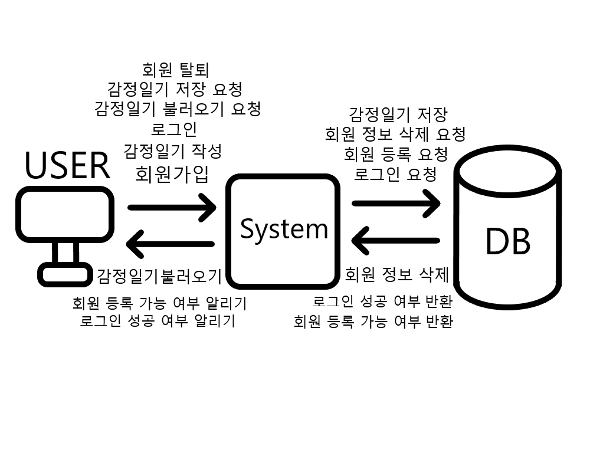

Re: Mind - 감정 일기장

리버전

---

**1. Business purpose**

---

**2. System context diagram**

[user] <---> [system] <---> [DB]

---

**3. Use case list**

1\) 회원가입

|Actor|user|
|:------:|:------|
|Description|id와 비밀번호를 입력하고 id가 중복이 아니면서 비밀번호가 조건을 만족 한다면 id와 비밀번호를 서버에 등록한다.|

2\) 로그인

|Actor|user|
|:------:|:------|
|Description|id와 비밀번호를 입력하고 id가 서버에 등록이 되었으며 id와 매칭되는 비밀번호를 입력하였으면 그 회원의 정보로 서버에 접속한다.|

3\) 비밀번호 변경

|Actor|user|
|:------:|:------|
|Description|새로운 비밀번호를 입력하고 비밀번호 확인란에 새로운 비밀번호와 일치한 비밀번호를 입력하면 그것으로 사용자의 비밀번호를 갱신한다.|

4\) 일기 작성

|Actor|user|
|:------:|:------|
|Description|감정 일기를 작성할 수 있는 창을 연다.|

5\) 감정 추가

|Actor|user|
|:------:|:------|
|Description|자신이 느낀 감정 카테고리에서 선택하거나 적을 수 있는 칸과 감정에 대한 세부적인 작성할 수 있는 칸을 추가한다.|

6\) 사건 추가

|Actor|user|
|:------:|:------|
|Description|자신이 어떤 이벤트에서 그런 감정을 느꼈는지를 적을 수 있는 칸을 추가한다.|

7\) 이미지 추가

|Actor|user|
|:------:|:------|
|Description|사진파일을 삽입할 수 있는 칸을 추가한다.|

8\) 저장

|Actor|user|
|:------:|:------|
|Description|유저가 작성한 일기를 저장한다.|

9\) 불러오기

|Actor|user|
|:------:|:------|
|Description|유저가 작성한 일기를 보거나 편집한다.|

10\) 일기 조회

|Actor|user|
|:------:|:------|
|Description|유저가 그동안 작성한 일기들을 조회한다.|

11\) 유저 정보 조회

|Actor|user|
|:------:|:------|
|Description|유저에 대한 정보를 조회한다.|

12\) 회원 탈퇴

|Actor|user|
|:------:|:------|
|Description|비밀번호를 입력하고 일치한 비밀번호를 입력했다면 유저에 대한 정보를 삭제한다.|

---

**4. Concept of operation**

1. 회원가입

|Purpose|앱 시작시 id가 없거나 id를 추가하고 싶은 경우 회원가입을 할 수 있게 한다.|
|:------:|:------|
|Approach|id 입력칸에 입력한 id가 서버에 등록된 id중에서 중복되지 않았다면 해당아이디로 가입이 가능하게 한다.|
|Dynamics|감정일기를 작성하거나 저장하고 싶은 경우.|
|Goals|회원가입 기능을 구현한다.|

2. 로그인

|Purpose|자신의 회원정보로 서버에 접속을 할 수 있어야 한다.|
|:------:|:------|
|Approach|앱을 실행했을 때 로그인을 할 수 있게 한다.|
|Dynamics|감정일기를 작성하거나 저장하고 싶은 경우.|
|Goals|로그인 기능을 구현한다.|

3. 비밀번호 변경

|Purpose|사용자가 원할때 비밀번호를 변경할 수 있어야 한다.|
|:------:|:------|
|Approach||
|Dynamics|자신의 비밀번호를 변경하고 싶은 경우.|
|Goals|사용자의 비밀번호를 변경하는 기능을 구현한다.|

4. 일기 작성

|Purpose|txt|
|:------:|:------|
|Approach|txt|
|Dynamics|감정 일기의 내용을 추가 및 작성하고 싶은 경우.|
|Goals|txt|

5. 감정 추가

|Purpose|txt|
|:------:|:------|
|Approach|txt|
|Dynamics|감정 일기에서 감정에 대한 정보를 작성 및 추가하고 싶은 경우|
|Goals|txt|

6. 사건 추가

|Purpose|txt|
|:------:|:------|
|Approach|txt|
|Dynamics|감정 일기에서 감정과 관련된 일어났던 일에 대한 정보를 작성 및 추가하고 싶은 경우|
|Goals|txt|

7. 이미지 추가

|Purpose|txt|
|:------:|:------|
|Approach|txt|
|Dynamics|감정 일기에서 그림이나 사진을 추가하고 싶은 경우|
|Goals|txt|

8. 저장

|Purpose|작성해둔 일기의 내용을 저장할 수 있어야 한다.|
|:------:|:------|
|Approach|txt|
|Dynamics|작성한 감정 일기를 저장하고 싶은 경우|
|Goals|txt|

9. 불러오기

|Purpose|txt|
|:------:|:------|
|Approach|txt|
|Dynamics|작성했던 감정 일기의 내용을 보거나 편집하고 싶은 경우.|
|Goals|txt|

10. 일기 조회

|Purpose|작성했던 일기들을 조회.|
|:------:|:------|
|Approach|사용자는 자신의 id로 작성한 일기들을 |
|Dynamics|자신이 그동한 작성했던 감정 일기들을 확인하고 싶은 경우|
|Goals|보기 편한 형태로 사용자가 작성했던 일기들을 조회한다.|

11. 유저 정보 조회

|Purpose|로그인된 사용자의 회원정보를 확인할 수 있어야 한다.|
|:------:|:------|
|Approach|txt|
|Dynamics|자신의 회원 정보를 보고싶은 경우|
|Goals|txt|

12. 회원 탈퇴

|Purpose|회원 정보를 삭제할 수 있어야 한다.|
|:------:|:------|
|Approach|txt|
|Dynamics|txt|
|Goals|회원 정보를 삭제하고 싶은 경우|

---

**5. Problem statement**

1. 데이터베이스 및 서버의 숙련도 부족

2. 보안

3. 최적화

---

**6. Glossary**

|용어|설명|
|:------:|:------|
|감정|txt|
|사건|txt|
|이미지|txt|

---

**7. References**
