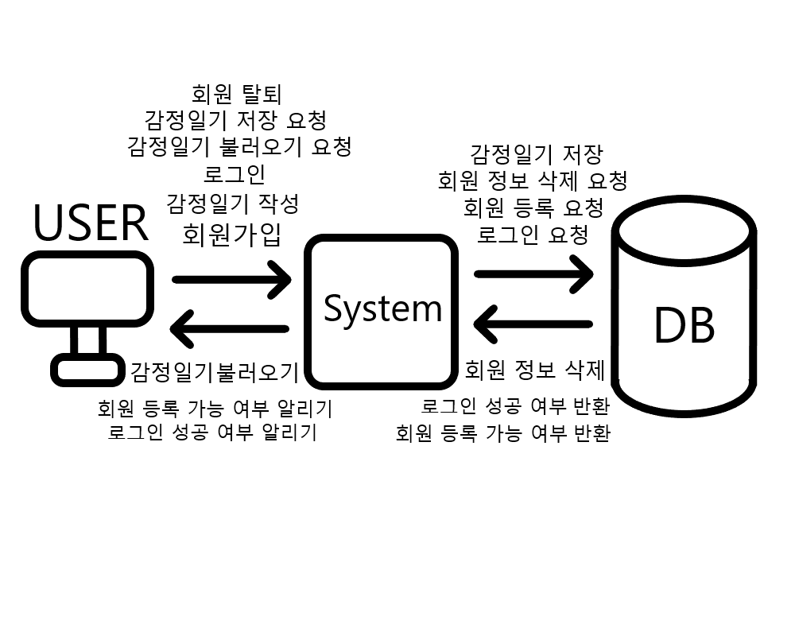

[Revision history]

|Revision date|Version #|Description|Author|
|:------:|:------:|:------:|:------:|
||0.3.3|로그인, 회원가입 기능 완성||
||0.6.6|일기를 작성하는 기능 완성||
||0.9.9|일기를 저장하고 불러오는 기능 완성||
||1.0.0|전체적인 기능 완성||

---

= Contents =

1. Business purpose
2. System context diagram
3. Use case list
4. Concept of operation
5. Problem statement
6. Glossary
7. References

---

**1. Business purpose**

최근 현대인들 사이에서 정신건강 및 심리에 관한 관심이 높아졌다.
그리고 자기자신에 대해 잘 알고싶어하는 사람들도 많아졌다.
자기자신에 대해 잘 알아가는 방법으로 다양한 검사들이나 상담 등 의 방법이 있지만 시간이나 비용이 많이 들어서 부담스러운 경우들이 있다.
그래서 자기자신에 대해 잘 알아가는것에 도움이 되면서 별로 부담이 되지 않는 프로그램을 만들고자 한다.
그리고 그러한 조건을 만족할 수 있는 프로그램으로 감정일기를 작성할 수 있는 프로그램을 선택하였다.
그 이유로는 감정일기를 작성하는 것이 자신의 감정을 파악하는 것에 도움이 되고 심리적 안정을 확보하는것에 도움이 되고 자기객관화 에도 도움이 되기때문에 자기자신을 알아가는것에 도움이 되며 일기형식으로 작성을 하는 방식이기에 시간과 비용이 크지도 않으니 목적에 부합하기 떄문이다.
그리고 프로그램으로 만들면 수기로 작성하지 않고, 간단하고 자유로운 형식으로 작성을 할 수 있는 형식으로 하여서 감정일기를 쉽게 작성할 수 있다는 장점도 있어서 수기로 작성하는 아날로그적인 방식과의 차별점도 있다고 생각한다.
이러한 이유로 감정일기를 작성할 수 있는 프로그램을 만들고자 한다.

---

**2. System context diagram**

---

**3. Use case list**

1\) 회원가입

|Actor|user|
|:------:|:------|
|Description|id와 비밀번호를 입력하고 id가 중복이 아니면서 비밀번호가 조건을 만족 한다면 id와 비밀번호를 서버에 등록한다.|

2\) 로그인

|Actor|user|
|:------:|:------|
|Description|id와 비밀번호를 입력하고 id가 서버에 등록이 되었으며 id와 매칭되는 비밀번호를 입력하였으면 그 회원의 정보로 서버에 접속한다.|

3\) 비밀번호 변경

|Actor|user|
|:------:|:------|
|Description|새로운 비밀번호를 입력하고 비밀번호 확인란에 새로운 비밀번호와 일치한 비밀번호를 입력하면 그것으로 사용자의 비밀번호를 갱신한다.|

4\) 유저 정보 조회

|Actor|user|
|:------:|:------|
|Description|User의 정보를 볼 수 있는 창을 연다.|

5\) 일기 목록 조회

|Actor|user|
|:------:|:------|
|Description|User가 작성한 일기들을 볼 수 있는 목록을 조회한다.|

6\) 일기 삭제

|Actor|user|
|:------:|:------|
|Description|선택한 날짜의 일기를 삭제한다.|

7\) 일기 선택

|Actor|user|
|:------:|:------|
|Description|자신이 적은 일기중 원하는 일기를 선택한다.|

8\) 일기 작성

|Actor|user|
|:------:|:------|
|Description|User가 작성한 일기를 저장한다.|

9\) 감정 추가하기

|Actor|user|
|:------:|:------|
|Description|자신이 느낀 감정 카테고리에서 선택하거나 적을 수 있는 칸과 감정에 대해 세부적인 작성할 수 있는 칸을 추가한다.|

10\) 사건 추가하기

|Actor|user|
|:------:|:------|
|Description|자신이 어떤 이벤트에서 그런 감정을 느꼈는지를 적을 수 있는 칸을 추가한다.|

11\) 이미지 첨부

|Actor|user|
|:------:|:------|
|Description|사진파일을 삽입할 수 있는 칸을 추가한다.|

12\) 일기 추가

|Actor|user|
|:------:|:------|
|Description|새로운 날짜의 일기를 추가한다.|

13\) 회원 탈퇴

|Actor|user|
|:------:|:------|
|Description|비밀번호를 입력하고 일치한 비밀번호를 입력했다면 User에 대한 정보를 삭제한다.|

---

**4. Concept of operation**

1. 회원가입

|Purpose|앱 시작시 id가 없거나 id를 추가하고 싶은 경우 회원가입을 할 수 있게 한다.|
|:------:|:------|
|Approach|id 입력칸에 입력한 id가 서버에 등록된 id중에서 중복되지 않았다면 해당아이디로 가입이 가능하게 한다.|
|Dynamics|감정일기를 작성하거나 저장하고 싶은 경우.|
|Goals|회원가입 기능을 구현한다.|

2. 로그인

|Purpose|자신의 회원정보로 서버에 접속을 할 수 있어야 한다.|
|:------:|:------|
|Approach|앱을 실행했을 때 로그인을 할 수 있게 한다.|
|Dynamics|감정일기를 작성하거나 저장하고 싶은 경우.|
|Goals|로그인 기능을 구현한다.|

3. 비밀번호 변경

|Purpose|사용자가 원할때 비밀번호를 변경할 수 있어야 한다.|
|:------:|:------|
|Approach|입력받은 새 비밀번호로 비밀번호를 갱신되게 한다.|
|Dynamics|자신의 비밀번호를 변경하고 싶은 경우.|
|Goals|사용자의 비밀번호를 변경하는 기능을 구현한다.|

4. 유저 정보 조회

|Purpose|User에 관한 정보를 조회하고 수정할 수 있어야 한다.|
|:------:|:------|
|Approach|User의 정보를 볼 수 있고 User에 관한 정보를 수정할 수 있는 창을 만들어낸다.|
|Dynamics|자신의 정보를 조회하거나 수정하고 싶은 경우|
|Goals|User에 관한 정보를 볼 수 있고 User에 관한 정보를 수정할 수 있는 버튼이 있는 창을 구현한다.|

5. 일기 목록 조회

|Purpose|작성했던 일기들을 조회.|
|:------:|:------|
|Approach|User는 자신의 id로 작성한 일기들을 나열해서 보여준다.|
|Dynamics|자신이 그동한 작성했던 감정 일기들을 확인하고 싶은 경우.|
|Goals|보기 편한 형태로 사용자가 작성했던 일기들을 조회한다.|

6. 일기 삭제

|Purpose|작성했던 일기들을 삭제.|
|:------:|:------|
|Approach|User는 자신의 작성했던 일기들 중에서 원하는 것을 골라서 삭제한다.|
|Dynamics|자신이 그동한 작성했던 감정 일기들중 삭제하고 싶은 일기가 존재하는 경우|
|Goals|User가 작성한 일기들 중에서 원하는 부분을 골라서 삭제한다.|

7. 일기 선택

|Purpose|작성했던 일기들중에서 원하는 날짜의 일기를 선택.|
|:------:|:------|
|Approach|User는 자신의 작성했던 일기들 중에서 원하는 것을 선택한다.|
|Dynamics|자신이 그동한 작성했던 감정 일기들중 편집하거나 삭제하고 싶은 일기가 있는 경우|
|Goals|User가 작성한 일기들 중에서 원하는 부분을 선택한다.|

9. 일기 작성

|Purpose|감정 일기의 내용을 작성할 수 있어야 한다.|
|:------:|:------|
|Approach|감정 일기를 작성할 수 있는 창을 불러온다.|
|Dynamics|감정 일기의 내용을 추가 및 작성하고 싶은 경우.|
|Goals|감정 일기에 내용을 작성할 수 있는 기능을 구현한다.|

9. 감정 추가하기

|Purpose|감정 일기에서 추가적으로 사용자가 핵심적으로 느낀 감정과 세부적인 느낌을 기록할 공간이 있어야 한다.|
|:------:|:------|
|Approach|감정 일기에서 자신이 느낀 감정 카테고리에서 선택하거나 적을 수 있는 칸과 감정에 대한 세부적인 느낌을 작성할 수 있는 칸을 만들어낸다.|
|Dynamics|감정 일기에서 감정에 대한 정보를 작성 및 추가하고 싶은 경우.|
|Goals|감정 일기에서 원하는 만큼 감정에 대한 정보를 기록할 창을 만드는 기능이 있어야 한다.|

10. 사건 추가하기

|Purpose|감정 일기에서 추가적으로 사용자가 핵심적으로 느낀 감정과 느낌에 대한 사건 또는 일을 기록할 공간이 있어야 한다.|
|:------:|:------|
|Approach|감정 일기에서 자신이 느낀 감정과 관련된 사건이나 일들을 작성할 수 있는 칸을 만들어낸다.|
|Dynamics|감정 일기에서 감정과 관련된 일어났던 일에 대한 정보를 작성 및 추가하고 싶은 경우|
|Goals|감정 일기에서 원하는 만큼 감정과 관련된 사건이나 일에 대한 정보를 기록할 창을 만드는 기능이 있어야 한다.|

11. 이미지 첨부

|Purpose|감정 일기에서 추가적으로 이미지를 첨부할 공간이 있어야 한다.|
|:------:|:------|
|Approach|사진파일을 첨부할 수 있는 공간을 만들어 낸다.|
|Dynamics|감정 일기에서 그림이나 사진을 추가하고 싶은 경우|
|Goals|이미지 파일을 불러올 수 있는 칸을 만드는 기능이 있어야 한다.|

12. 일기 추가

|Purpose|감정 일기에서 새로운 날짜의 일기를 추가할 수 있어야 한다.|
|:------:|:------|
|Approach|새로운 날짜에 대한 일기를 추가한다.|
|Dynamics|감정 일기에서 새로운 날짜의 내용을 싶은 경우|
|Goals|감정일기 내용을 추가할 수 있는 기능을 구현한다.|

14. 회원 탈퇴

|Purpose|회원 정보를 삭제할 수 있어야 한다.|
|:------:|:------|
|Approach|회원에 대한 정보를 서버에서 삭제시킨다.|
|Dynamics|회원 정보를 삭제하고 싶은 경우.|
|Goals|회원에 대한 정보를 삭제하는 기능을 구현한다.|

---

**5. Problem statement**

1. 데이터베이스 및 서버의 숙련도 부족

프로그램에서 데이터베이스와 서버를 활용해야 하는데 프로그램을 제작하는 본인은 데이터베이스와 서버를 구축해본 경험이 없고 다루는 방법을 잘 모르기에 프로그램을 제작하는데에 있어 어려움이 될 것으로 예상된다.
서버 및 데이터베이스에 대해 별도의 공부를 하거나 관련 자료를 찾아보면서 서버 및 데이터베이스를 잘 다루지 못한다는 점을 보완해갈 예정이다. 하지만 그렇게 하고도 데이터베이스및 서버를 사용하는 것에 차질이 생긴다면 파일로 따로 저장하거나 서버를 이용하지않고, 로컬로 작동하는 방식등의 차선책도 고려해볼 예정이다.

2. 보안

앞은 예상되는 어려움인 데이터베이스 및 서버의 숙련도가 부족하기때문에 관련된 부분에서 보안적으로 미숙한 부분이 발생할 가능성이 있고 그 외에도 보안에 대해서 신경써서 프로그램을 완성하는것에 어려움이 있을 것으로 예상된다. 코드 검수를 꼼꼼하게 해서 보안을 최대한 신경써서 이 어려움을 보완해갈 예정이다.

3. 최적화

프로그램을 구현하는데 있어서 최적화를 하여서 완성하는것에는 어려움이 있을 것으로 예상된다. 위의 방법과 같이 코드 검수를 꼼꼼하게 하여서 최적화에 대한 어려움을 보완해갈 예정이다.

---

**6. Glossary**

|용어|설명|
|:------:|:------|
|감정|일기 내용에서 핵심적으로 느꼈던 감정이나 느낌을 의미합니다.|
|사건|그 감정을 느끼게된 핵심적인 사건이나 일, 경험을 의미합니다.|
|이미지|jpg, png 등 시각자료 형태의 파일을 의미합니다.|
|User|이 프로그램의 사용자를 의미합니다.|

---

**7. References**
